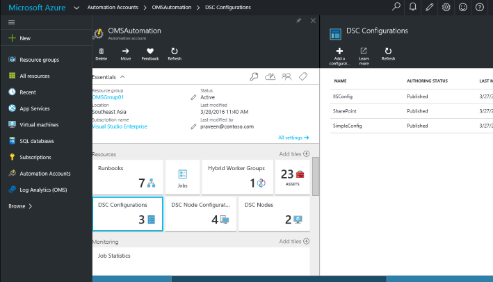

## What is PowerShell?

PowerShell is an automation platform and scripting language for Windows and Windows Server that allows you to simplify the management of your systems. Unlike other text-based shells, PowerShell harnesses the power of the .NET Framework, providing rich objects and a massive set of built-in functionality for taking control of your Windows environments. 

## PowerShell Desired State Configuration (DSC)

PowerShell Desired State Configuration (DSC) is a platform for testing and ensuring the declarative state of a system. DSC allows you to scale complex deployments across environments, enables collaboration of management, and corrects for configuration drift. 

## PowerShell ISE

The PowerShell Integrated Scripting Environment (ISE) is a Windows application that supports enhanced usage of PowerShell for beginners and experts alike. The ISE's many features include:

-   A built-in editor for writing, testing, and debugging scripts 
-   Full IntelliSense tab completion, syntax highlighting, and context-sensitive help
-   A myriad of keyboard shortcuts
-   Support for right-to-left languages
-   Extensible add-ons ([like these from our community](http://social.technet.microsoft.com/wiki/contents/articles/2969.windows-powershell-ise-add-on-tools.aspx))

## Extend the PowerShell Experience with Microsoft Operations Management Suite

Operations Management Suite (OMS) gives you visibility and control of your applications and workloads across Azure and other clouds. Integral to this, it enables customers to transform their cloud experience when using PowerShell for both Linux and Windows Server. [OMS Automation](https://www.microsoft.com/en-us/cloud-platform/automation-and-control) elevates PowerShell and [Desired State Configuration](https://azure.microsoft.com/en-us/documentation/articles/automation-dsc-overview/) (DSC) with a highly available and scalable management service from Azure. You can graphically author and manage PowerShell resources including runbooks, DSC configurations and DSC node configurations from one place. With OMS hybrid runbook workers, you can extend your OMS Automation capability and apply, monitor and update configurations anywhere, including on-premises.
